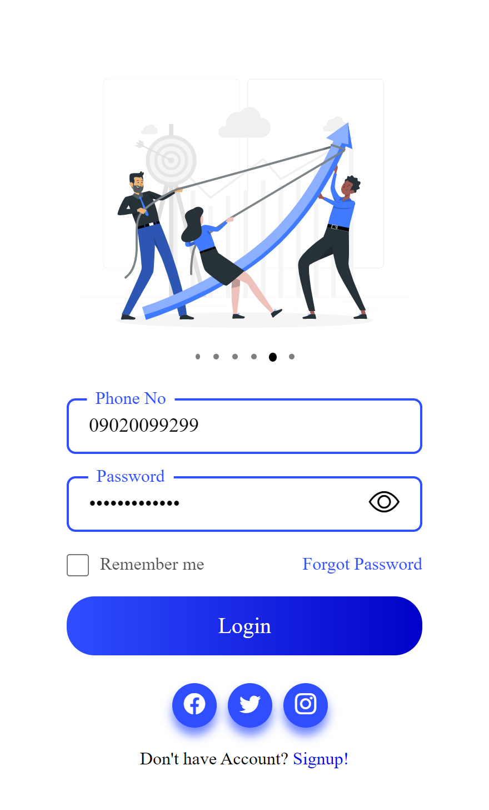
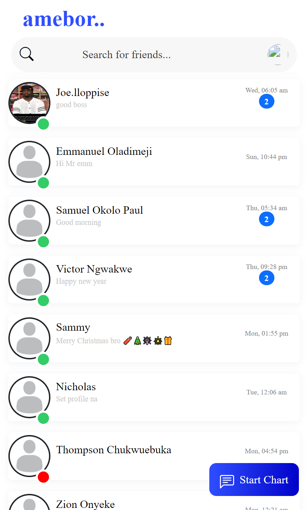

# 💬 Pure PHP Chat

A lightweight, responsive real-time chat application built with **pure PHP**, **MySQL**, and **AJAX** — no frameworks or JavaScript libraries required.





---

## 📌 Overview

**Pure PHP Chat** is a simple, secure, and fast real-time chat app designed for learning or lightweight messaging functionality. It demonstrates how to build a chat system without any frontend or backend frameworks — just raw PHP, MySQL, and vanilla JavaScript with AJAX.

---

## 🚀 Features

- ✅ Real-time messaging via AJAX polling
- 🔐 User authentication (login & register)
- 💡 Clean, responsive UI
- 🧩 No external libraries or frameworks
- 📦 Easy to extend and deploy

---

## 🧠 Tech Stack

- Backend: PHP 8 >
- Database: MySQL
- Frontend: HTML, CSS, JavaScript
- Realtime: Jquery AJAX long polling


---

## 🛠️ Getting Started

### 1. Clone the Repository

```bash
git clone https://github.com/Raphealmary/pure-php-chat.git
cd pure-php-chat
